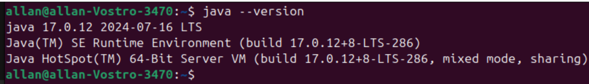
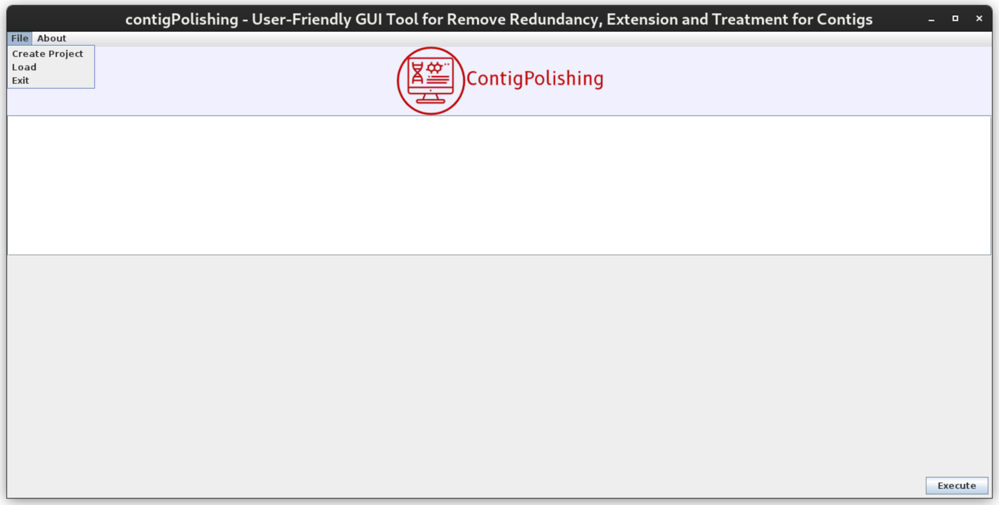
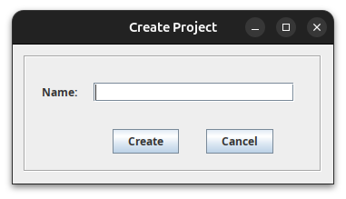
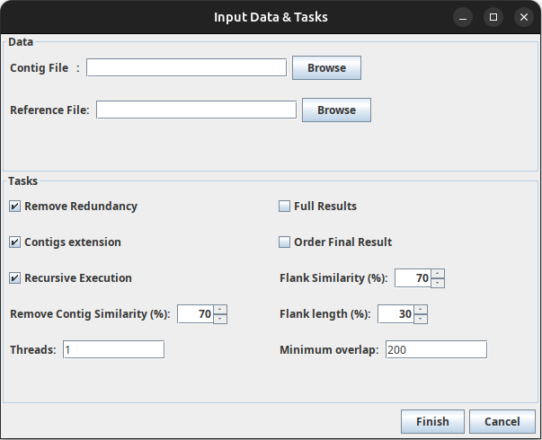
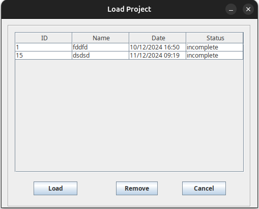
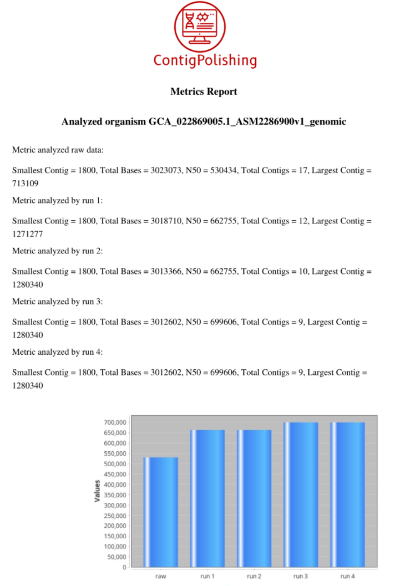

<p align="center">
  
</p>

# ContigPolishing: A User-Friendly Java GUI for Contig Extension and Refinement.
<p align="justify">To determine the gene content of an organism, the reads generated by the sequencing process must be assembled using an assembly strategy, either by reference or de novo. However, this process often results in multiple sequences called contigs, which, after the sorting steps, are grouped into scaffolds. The completion stage aims to obtain a single genomic sequence, called a complete genome, which is not a trivial task. Various analytical strategies have been developed to help in this process, many of which have been implemented in computer tools to obtain complete genomes or as close to this as possible, the so-called drafts. The manuscript presents ContigPolishing, a computational tool with a simple and intuitive graphical interface, developed to improve the assembly of prokaryotic genomes, such as bacteria and metagenomes. Despite existing software, there is a gap for solutions that combine simplicity and robustness. ContigPolishing addresses this need, featuring an integrated database that allows processing to be resumed at any time. The tool was validated with 90 NCBI datasets from genera such as Escherichia coli, Corynebacterium, and Nocardia, as well as raw reads from the SRA database to simulate real-world situations. The results showed improvement in the contiguity of the assemblies, with an increase in N50 and improvement in L50, and a reduction in the number of contigs, by extending the contigs using the similarity between their flanks. In some cases, the software was able to elevate the status of genomes from draft to complete, proving its efficiency.</p>

### Technology
<image src="https://github.com/allanverasce/allanverasce/assets/25986290/e9eef5db-3d9e-419d-bc31-c29c16076146" alt="Image" width="50"/>
<image src="https://github.com/allanverasce/allanverasce/assets/25986290/3f178481-786d-4e6f-b46f-7e10732e9ca8" alt="Image" width="50"/>


# Installation and User Guide 
<p align="justify"> Before you can use ContigPolishing, you need to install the JDK on your machine. Installation varies according to the operation system used. You can download the JDK for the
main operation system versions from Oracle’s official website. https://www.oracle.com/java/technologies/javase/jdk17-archive-downloads.html.</br> We recommend using version 17 or higher to ensure compatibility with
ContigPolishing. Let’s first check that you already have it installed, then follow the steps below: </p>

### Step 1: Install Dependencies

- Java installation:
```
  wget https://download.oracle.com/java/17/archive/jdk-17.0.12_linux-x64_bin.deb
  sudo apt install -y ./jdk-17.0.12_linux-x64_bin.deb
```
Test example:

 

**Warning:** If it responds with something like this, you already have Java installed, skip to installing BLAST. Otherwise, follow the steps below.

- Blast installation:
```
sudo apt update
sudo apt install -y ncbi-blast+
```

### Step 2: Let's run
<p align="justify">Open the terminal using the shortcut `Ctrl + Alt + T`. From the folder where you downloaded contigPolishing, run the line below.</p>

```
java -jar contigPolishing.jar
```
If you want to adjust the amount of memory available on your device, you can use the example below as a guide. Note that we have adjusted it to use 16 GB, but you can adjust it to suit your needs:

```
java -jar -Xmx16G contigPolishing.jar
```


# Main Window
<p align="justify"> The Main Window is the starting point for interacting with the software. Here you can perform the following actions via the File menu: </p>

1. Create a new project: This allows you to start a new project, setting it up according to your needs.
2. Load an existing project: Opens a previously saved project, allowing you to continue where you left off.
3. Stop running the software: Closes the software securely, ensuring that no information is lost.



-------
# Creating your project
To create a new project, follow the steps below:
1. Click on the File menu on the main toolbar.
2. Select the Create Project option.
3. A new window will appear, allowing you to set up your project.
4. Enter the name of the project in the appropriate field.
After entering the name, click the Create button to complete the project creation.

 

-------
# Input Data & Tasks window
After clicking the Create button, the user will be directed to the Input Data & Tasks window. At this stage, you need to provide the following information:
1. Input directory: Enter the path where the FASTA file(s) to be processed are located (the extension must be .fasta). Annotated reference file (optional).
2. If you'd like to order the results, please insert the reference file in GenBank format (extension .gb).
**Important:** If the ordering task is selected, the input folder must contain only the file you want to order. Otherwise, the software will process all the FASTA files found in the input folder using the same reference.



This feature has been developed to make it easier to process multiple datasets of the same genre efficiently.

In the same window (Input Data & Tasks), the user can configure the tasks to be performed and set the corresponding parameter values.
## Available tasks:
- Redundancy removal: Eliminates redundant sequences to optimize results.
- Contig extension: Extends contiguous sequences based on the data provided.
- Recursive execution: Allows tasks to be executed iteratively until the defined criteria are reached.
- Sorting the results: Sorts the results using the GenBank reference file (if provided).
- Complete or intermediate results:
  1. The user can choose to save only the final results.
  2. Otherwise, the intermediate results will be discarded.

## Configurable parameters:

- Percentage of flank length: Defines the minimum proportion of the flank that will be considered for extension or sorting.
- Similarity percentage between flanks: Specifies the minimum identity ratio for combining flanks.
- Minimum contig length: Determines the minimum size a contig must have to be considered.
- Minimum overlap length: Establishes the minimum number of bases that two sequences must share to be joined.
- Number of threads (CPUs): Sets the number of threads the software can use to optimize performance.
**Warning:** If the user does not change any of the values, the default value for each parameter will be used.

-------
# Starting Processing
Once you have finished configuring the input data and setting the parameters, follow the steps below to start processing:
- Click the Finish button to confirm the settings in the Input Data & Tasks window.
- You will be redirected to the Main Window.
- In the Main Window, click the Execute button to start processing.
- The software will start executing the selected tasks, applying the parameters set. Make sure all the settings are correct before starting the process

-------
# Loading or Removing Projects
To manage projects in the Load Window, follow the instructions below: 
- Load a project: Select the desired project from the list displayed. Click the Load button to open the project and continue processing.
- Remove a project: Select the project you want to delete from the list. Click the Remove button to remove it permanently.
**Warning:** Make sure you really want to delete a project before confirming the removal, as this action is irreversible.



-------
# Monitoring processing
When you start processing the project, you can follow the progress in real time via the Log Area.
- Log area: Displays detailed information on the progress of processing. It shows messages about each stage, allowing the user to identify possible errors or bottlenecks in the flow.
- Graph display: After the FASTA file has finished processing, graphs with metric evaluations will be displayed automatically.
- For multiple runs, the graphs will show a comparison between the raw dataset and the results processed in each run.
- This visualization makes it easier to analyze the impact of each run on the metrics evaluated.

  

-------

# Expected file structure
- File with redundancy removed (ending with TratedCuckoo.fasta):
  
  **Example:** 5275.2_ASM1659527v2_genomic_TratedCuckoo.fasta

- Final processing FASTA file (with the executions):
  
  **Exemple:** GCA_016595275.2_ASM1659527v2_genomic_TratedCuckoo_run1_run2.fasta

- If it has been ordered, the extension will contain the name ordered.fasta:
  
  **Exemple:** GCA_016595275.2_ASM1659527v2_genomic_TratedCuckoo_run1_run2_ordered.fasta

- PDF file as a full report: At the end of processing, a PDF file is generated containing all the metrics evaluated along with comparative graphs.

  


