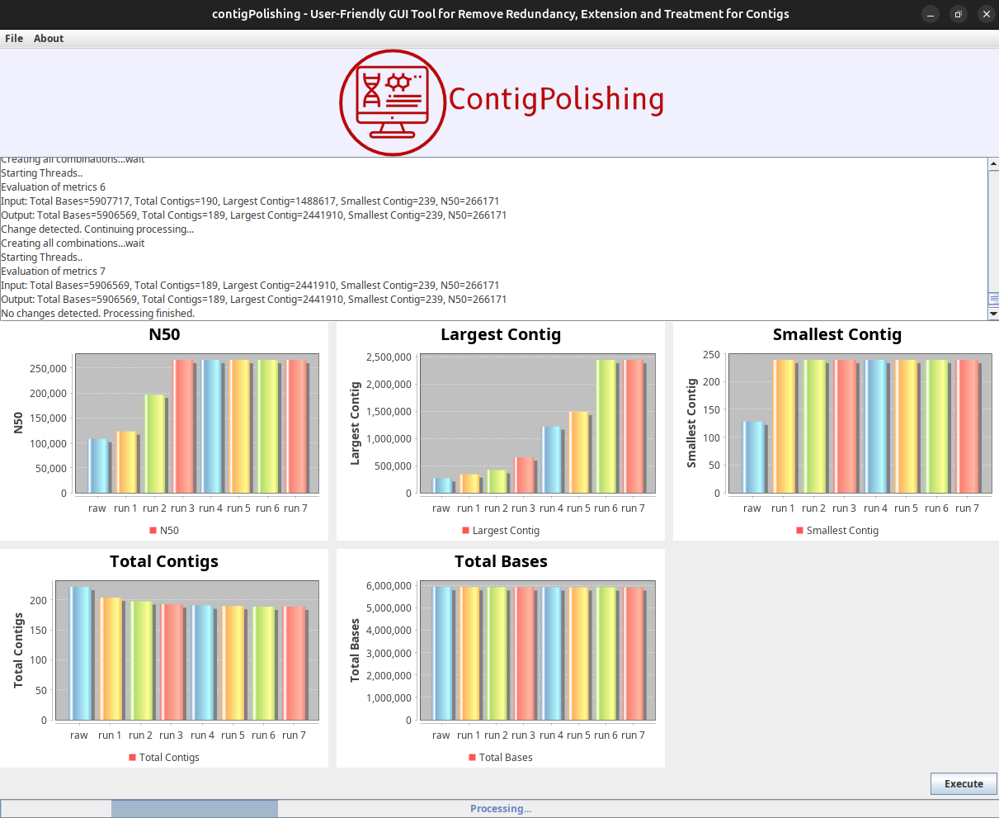

# ContigPolishing: A User-Friendly Java GUI for Contig Extension and Refinement.
<p align="justify"> In order to determine the gene content of an organism, it is essential that the reads generated by the sequencing process are assembled using an assembly strategy, either by reference or de novo. However, this process often results in multiple sequences called contigs, which, after the completion and sorting steps, are grouped into scaffolds. The aim of the completion stage is to obtain a single genomic sequence, called a complete genome, which is not a trivial task. Various analytical strategies have been developed to help in this process, many of which have been implemented in computer tools with the aim of obtaining complete genomes or as close as possible to this, the so-called drafts. However, despite the advances and accuracy of the software available, there is still a gap in the development of user-friendly solutions that combine flexibility, simplicity and robustness in data processing. In this paper, we present ContigPolishing, a computer tool with a simple and intuitive graphical interface. The tool has an integrated database that allows processing to be resumed from the point of interruption, eliminating technical complexity for the user and significantly simplifying its use. ContigPolishing was validated using datasets obtained from NCBI, totaling 90 organisms belonging to the Escherichia coli, Corynebacterium and Nocardia genera. In addition, raw reads were downloaded from the SRA database to simulate common scenarios faced by researchers when carrying out the assembly and finalization process. The results showed, in most cases, an increase in N50 values, indicating greater contiguity of the assemblies, as well as a reduction in the total number of contigs, without significant losses in the total number of bases or information related to gene content, demonstrating the efficiency of the software.</p>

### Technology
<image src="https://github.com/allanverasce/allanverasce/assets/25986290/e9eef5db-3d9e-419d-bc31-c29c16076146" alt="Image" width="50"/>
<image src="https://github.com/allanverasce/allanverasce/assets/25986290/3f178481-786d-4e6f-b46f-7e10732e9ca8" alt="Image" width="50"/>


## Quick Guide for the Impatient

Step 1: Install Dependencies
To install the necessary dependencies for contigPolishing, follow the steps below:
- Open the terminal or command prompt (Ctrl + Alt + T) and navigate to the directory where the dependencyInstaller.jar file is located.
- Run the following command to start the installer:

```
java -jar dependencyInstaller.jar
```

- Installation Window: After running the command above, a graphical window will open. Click the "Install" button to begin the installation process.
- Administrator Authentication: The installer will ask for your sudo password. This is usually the same as your login password. Enter the password and press OK.


### Let's run
Open the terminal using the shortcut `Ctrl + Alt + T`. From the folder where you downloaded contigPolishing run the line below.
```
java -jar contigPolishing.jar
```

### Screenshots
    


